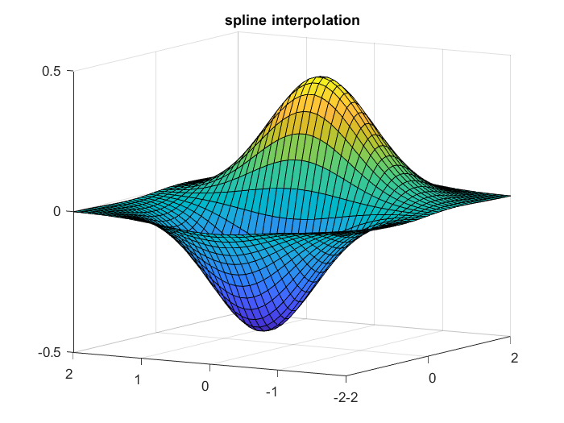

### Julia
- Stockholm School of Economics MSc in Economics
- [5329 - Inequality, Household Behavior, & the Macroeconomy, Spring 2024](https://pcw.hhs.se/courses/5329)

   

### MATLAB
- PhD in Economics at Stockholm University
- [Computational economics bootcamp, 19–22 August 2024](https://www.su.se/department-of-economics/education/courses-and-programmes/computational-economics-bootcamp-19-22-august-2024-no-credits-1.558037?eventopenforinternationalstudents=true&notforcedreason=0&q=&xpanded=)

   

